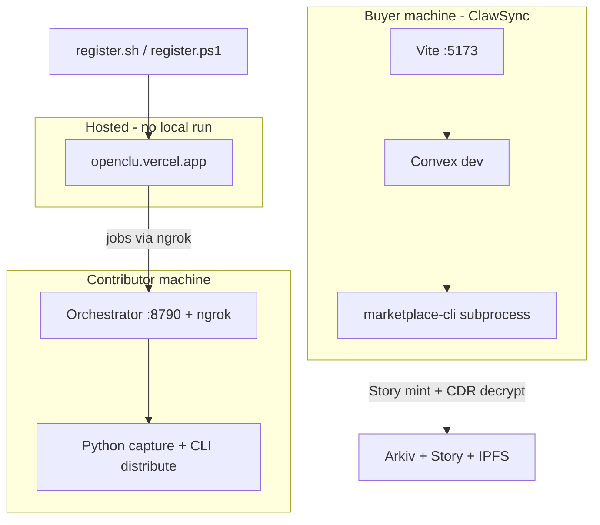

# OpenClu — Setup and full-flow runbook

This guide installs everything you need locally, registers a capture device against the **hosted** dashboard, publishes skills or training data, and purchases listings with **ClawSync**.

**You do not need to run `frontend/` locally.** The contributor dashboard is deployed at [https://openclu.vercel.app](https://openclu.vercel.app).

---

## Install everything (one command)

From the **repository root**:

**Windows (PowerShell):**

```powershell
.\scripts\setup-all.ps1
```

**macOS / Linux:**

```bash
chmod +x scripts/setup-all.sh
./scripts/setup-all.sh
```

**Manual equivalent** (if you prefer not to use the script):

```powershell
# Windows — from repo root
cd skill-capture; if (-not (Test-Path venv)) { python -m venv venv }; .\venv\Scripts\Activate.ps1; npm run setup; cd ..\clawsync; npm install
```

```bash
# macOS / Linux — from repo root
cd skill-capture && python3 -m venv venv && source venv/bin/activate && npm run setup && cd ../clawsync && npm install
```

This installs:

- Python deps (`requirements.txt`, including ffmpeg via `imageio-ffmpeg`)
- Node packages for `skill-capture/cdr`, `arkiv`, `cli`, `orchestrator`
- `clawsync` + `skill-marketplace` (via `postinstall`)

---

## Architecture



| Role | What runs locally | What runs hosted |
|------|-------------------|------------------|
| **Contributor** | Orchestrator, capture, Story/CDR/Arkiv publish | Login, register device, Contribute UI |
| **Buyer** | ClawSync (Convex + Vite + optional Helia) | — |

**SDK note:** Story CDR uses `@piplabs/cdr-sdk` and `@story-protocol/core-sdk` in TypeScript. Arkiv uses `@arkiv-network/sdk`. This repo uses **local `tsx` scripts**, not official Arkiv/CDR shell CLIs.

---

## Prerequisites

| Requirement | Notes |
|-------------|--------|
| **Node.js 22+** | skill-capture orchestrator / CLI |
| **Node.js 18+** | clawsync (18+ is enough) |
| **Python 3.10+** | Screen/voice capture, training video |
| **Git** | Clone this repo |

### Accounts and API keys

| Key | Where | Purpose |
|-----|--------|---------|
| [ngrok authtoken](https://dashboard.ngrok.com/get-started/your-authtoken) | `skill-capture/.env` → `NGROK_AUTHTOKEN` | Public URL so the Vercel app can reach your orchestrator |
| **Groq** | `skill-capture/.env` → `GROQ_API_KEY` | Transcription and skill extraction on device |
| **Pinata** API key + secret | `skill-capture/.env` → `PINATA_API_KEY`, `PINATA_SECRET_KEY` | Public IPFS pin at publish (buyers fetch ciphertext by CID) |
| **Privy wallet** | Browser only | Owner login on [openclu.vercel.app](https://openclu.vercel.app) |
| **Buyer wallet** | `clawsync/.env` → `AGENT_PRIVATE_KEY` | Story Aeneid license mint when purchasing |
| **Anthropic** (or Groq) | `clawsync/.env` + Convex env | ClawSync chat and setup wizard |

### Testnet funds

After device registration, fund the printed **device wallet**:

- **Story Aeneid** — IP / WIP for IP registration and license terms
- **Braga GLM** — [Braga faucet](https://braga.hoodi.arkiv.network/faucet/) for Arkiv catalog writes

Fund the **buyer wallet** (`AGENT_PRIVATE_KEY`) with Aeneid IP before purchasing in ClawSync.

---

## Environment files

Copy examples and fill secrets. **Never commit `.env` files with real keys.**

### `skill-capture/.env`

Copy from [`skill-capture/.env.example`](skill-capture/.env.example):

```env
GROQ_API_KEY=
NGROK_AUTHTOKEN=
FRONTEND_URL=https://openclu.vercel.app
PINATA_API_KEY=
PINATA_SECRET_KEY=
PINATA_BUYER_GATEWAY=https://gateway.pinata.cloud/ipfs
CDR_PUBLISH=1
```

`register.ps1` / `register.sh` will append `DEVICE_*` and `REGISTRATION_TOKEN` after you register.

### `skill-capture/cdr/.env` (optional)

Copy from [`skill-capture/cdr/.env.example`](skill-capture/cdr/.env.example) only if you need custom Story RPC URLs. Publish/signing uses the **device wallet** from `skill-capture/.env`.

### `clawsync/.env`

Copy from [`clawsync/.env.example`](clawsync/.env.example):

```env
AGENT_PRIVATE_KEY=0x...
ANTHROPIC_API_KEY=sk-ant-...
GROQ_API_KEY=gsk_...
PINATA_BUYER_GATEWAY=https://gateway.pinata.cloud/ipfs
```

Optional: `CDR_STORAGE_URL=http://127.0.0.1:8787` when running `npm run cdr-storage`.

### Hosted dashboard (operator)

Device registration uses **Supabase** on Vercel ([`frontend/src/app/api/devices/register/route.ts`](frontend/src/app/api/devices/register/route.ts)). Contributors only set **local** env. If pending registration or confirm fails on the live site, the deployed app needs `SUPABASE_*` and Privy variables configured on Vercel — that is not fixed on your laptop.

---

# Part A — Contributor: register device and publish

Use [https://openclu.vercel.app](https://openclu.vercel.app). **Do not** run `cd frontend && npm run dev` for this flow.

## Terminal A — Orchestrator (keep running)

**Windows:**

```powershell
cd skill-capture\orchestrator
npm run start
```

**macOS / Linux:**

```bash
cd skill-capture/orchestrator
npm run start
```

- Listens on `http://127.0.0.1:8790`
- With `NGROK_AUTHTOKEN` in `skill-capture/.env`, logs print an **ngrok HTTPS URL**

**Verify:** open `http://127.0.0.1:8790/health` — JSON should include `"publicUrl": "https://....ngrok..."`. If `publicUrl` is missing, set `NGROK_AUTHTOKEN` and restart.

Leave this terminal open for registration and all Contribute sessions.

## Terminal B — Register device

**Windows:**

```powershell
cd skill-capture
.\venv\Scripts\Activate.ps1
# Confirm skill-capture\.env has FRONTEND_URL=https://openclu.vercel.app
.\register.ps1
```

**macOS / Linux / Git Bash:**

```bash
cd skill-capture
source venv/bin/activate
export FRONTEND_URL=https://openclu.vercel.app
./register.sh
```

The script will:

1. Derive a **device wallet** and write it to `skill-capture/.env`
2. Read the orchestrator **ngrok URL** from `/health` (orchestrator must be running)
3. POST pending registration to `https://openclu.vercel.app/api/devices/pending`
4. Print a **QR code** and registration URL

**Then:**

1. Fund the printed device wallet (Story Aeneid + Braga GLM).
2. Scan the QR or open the URL in your browser.

## Browser — Register device

Registration URL query params: `token`, `address`, `deviceName`, `orchestratorUrl`.

1. Open the link from the QR (or the printed URL).
2. If prompted, click **Connect owner wallet** (Privy).
3. Confirm the card shows:
   - **Device** name
   - **Wallet** (device address)
   - **Portal** (your ngrok URL — must not say “Unavailable”)
4. Badge should read **Ready to confirm**. If it says **Registration link incomplete**, orchestrator/ngrok was not running when you ran `register` — restart orchestrator and run register again.
5. Click **Confirm registration**.
6. You are redirected to `/login`. Click **Connect wallet** if needed; you are sent to **Contribute**.

Login URL: [https://openclu.vercel.app/login](https://openclu.vercel.app/login)

## Browser — Contribute (skill or training data)

URL: [https://openclu.vercel.app/contribute](https://openclu.vercel.app/contribute) (requires owner wallet session).

### Stage 1 — Skill brief

1. Open the **Skill brief** tab (default).
2. Fill **Title** and **Description** (required).
3. Optional: **Triggers** (one per line), **Extra tags** (comma-separated), **Expertise source**.
4. Note the generated slug under the title field.
5. Click **Save and continue**.

### Stage 2 — Recording setup

1. Open the **Recording setup** tab.
2. Click **Choose device**.
3. Select your registered device (must show a portal/orchestrator URL).
4. Click **Save and continue**.

### Stage 3 — Capture console

1. Open the **Capture console** tab.
2. Choose one mode:

| Mode | UI label | What it does |
|------|----------|----------------|
| **Skill** | **Record skill** | Screen + voice → `SKILL.md` via Groq |
| **Training data** | **Record training data** | Camera + microphone → `TRAINING.md` + `video.b64` |

3. Click the card for your mode. The UI saves the draft on device if needed, then starts a job.
4. In **Terminal A (orchestrator)**, when recording is active, type **`q`** and press **Enter** to stop capture.
5. The UI polls job logs. After capture succeeds it automatically runs **distribute** (Story IP + CDR encrypt + Arkiv listing).
6. Wait until logs show publish success (toast: skill or training data listed on Arkiv).

**While contributing:** keep Terminal A (orchestrator + ngrok) running.

**Publish requirements:**

- `PINATA_API_KEY` and `PINATA_SECRET_KEY` in `skill-capture/.env`
- Funded device wallet on Aeneid + Braga

---

# Part B — Buyer: ClawSync (purchase skills and training data)

All commands below are from [`clawsync/`](clawsync/). You need at least one listing published in Part A (or an existing Arkiv catalog entry).

## 1. Configure environment

```powershell
cd clawsync
copy .env.example .env
```

Edit `.env`:

- `AGENT_PRIVATE_KEY` — buyer wallet (fund with Story Aeneid IP)
- `ANTHROPIC_API_KEY` — required for setup wizard and default chat
- `GROQ_API_KEY` — recommended (Groq models, marketplace tooling)

## 2. Sync Convex environment variables

Convex actions do **not** reliably read `.env` alone. Set keys in the Convex project:

```bash
cd clawsync
npx convex dev
```

In a **second** terminal (while `convex dev` is linked to your project):

```bash
cd clawsync
npx convex env set AGENT_PRIVATE_KEY 0x<your-64-char-hex>
npx convex env set ANTHROPIC_API_KEY sk-ant-...
npx convex env set GROQ_API_KEY gsk_...
```

Local dev also loads listed keys from `clawsync/.env` via [`convex/lib/clawsyncDotenv.ts`](clawsync/convex/lib/clawsyncDotenv.ts) — set **both** for reliability.

## 3. Terminals to run (complete list)

Open **three** terminals in `clawsync/` (or two if you skip Helia — purchases work but are slower):

| # | Command | Purpose |
|---|---------|---------|
| **1** | `npx convex dev` | Convex backend, codegen, marketplace subprocess host |
| **2** | `npm run dev` | Vite UI at **http://localhost:5173** |
| **3** | `npm run cdr-storage` | **Recommended** — Helia on port **8787**; Convex auto-uses it when healthy for faster decrypt |

First-time Convex: when you run `npx convex dev`, follow prompts to create or link a Convex project.

## 4. First visit — setup wizard

1. Open **http://localhost:5173**
2. Complete the **setup wizard** (agent name, soul document, model).
3. For marketplace tool calling, choose **Llama 4 Scout (Groq tools)** or another Groq model.
4. Open **SyncBoard** from the app navigation.

If `SYNCBOARD_PASSWORD_HASH` is set in Convex, log in on the SyncBoard login page first.

## 5. Purchase agent skills

1. In SyncBoard, go to **Skills Marketplace** (nav: **Skills Marketplace**, path `/syncboard/skills/purchase`).
2. Use **Search** or **Browse all** to load Arkiv catalog listings.
3. Click a listing card to open the detail dialog.
4. Confirm the buyer wallet is configured (the page checks wallet status on load).
5. Click the primary purchase button (shows minting fee, e.g. **`1 IP`**).
6. Watch the **Purchase log** in the dialog and `[skill-marketplace]` lines in the **`npx convex dev`** terminal.
7. On success, go to **My Skills** (`/syncboard/skills`) — the skill is imported to the default agent.
8. Open **Chat** (`/chat`) and send a message that should use the purchased skill.

Decrypted files default to `clawsync/data/purchased-skills/<slug>/`.

## 6. Purchase training data

1. SyncBoard → **Purchase Training Data** (`/syncboard/training-data/purchase`).
2. Search or browse → open a training listing.
3. Click the purchase button (minting fee in IP).
4. On success, open **My Training Data** (`/syncboard/training-data`) to inspect `TRAINING.md` and decrypted video assets.

Decrypted files default to `clawsync/data/purchased-training-data/<slug>/`.

## 7. Optional — Train your AI (local fine-tune)

1. One-time Python setup:

```powershell
cd clawsync\local-trainer
py -3.11 -m venv .venv
.\.venv\Scripts\Activate.ps1
pip install -r requirements.txt
```

2. From `clawsync/` root, start the trainer API:

```powershell
npm run trainer:dev
```

3. In SyncBoard, open **Train your AI** (`/syncboard/train-ai`) and select purchased training data.

See [`clawsync/local-trainer/README.md`](clawsync/local-trainer/README.md) for model download and training steps.

## 8. Optional — Chat-driven purchase

With `GROQ_API_KEY` and `AGENT_PRIVATE_KEY` set, agent **Chat** can call marketplace tools (`search_arkiv_skills`, `purchase_and_attach_skill`) in addition to the SyncBoard purchase pages.

---

## Verification checklist

- [ ] `http://127.0.0.1:8790/health` returns `publicUrl` (ngrok)
- [ ] Device appears in Contribute **Choose device**
- [ ] Publish completes; orchestrator/UI logs show Arkiv listing key
- [ ] ClawSync **Skills Marketplace** or **Purchase Training Data** finds the listing
- [ ] Purchase succeeds; files under `clawsync/data/purchased-skills/` or `purchased-training-data/`
- [ ] **My Skills** / **My Training Data** shows the import

---

## Troubleshooting

| Symptom | What to do |
|---------|------------|
| Registration link incomplete | Start orchestrator first; ensure ngrok `publicUrl` in `/health`; re-run `register.ps1` / `register.sh` |
| **Confirm registration** disabled | QR missing `orchestratorUrl` — orchestrator was down during register |
| Pending registration POST failed | Check `FRONTEND_URL=https://openclu.vercel.app`; hosted app needs Supabase (operator) |
| Contribute jobs fail immediately | Wrong device selected; orchestrator stopped; stale ngrok URL — re-register |
| Capture never stops | Type **`q`** + Enter in the **orchestrator** terminal |
| Distribute / Pinata errors | Set `PINATA_API_KEY` and `PINATA_SECRET_KEY` in `skill-capture/.env` |
| Insufficient funds on publish | Fund device wallet on Aeneid + Braga GLM |
| ClawSync purchase fails | Fund `AGENT_PRIVATE_KEY`; run `npx convex env set AGENT_PRIVATE_KEY ...`; run `npm run cdr-storage`; read `npx convex dev` logs |
| `tsx` or `@arkiv-network/sdk` missing | Re-run `.\scripts\setup-all.ps1` or `cd clawsync && npm install` |
| Marketplace CLI cannot find repo | Set `CLAWSYNC_ROOT` to your `clawsync` folder path in Convex env if needed |

---

## Further reading

| Doc | Content |
|-----|---------|
| [`README.md`](README.md) | Product overview and architecture |
| [`skill-capture/README.md`](skill-capture/README.md) | Capture pipeline detail |
| [`clawsync/README.md`](clawsync/README.md) | ClawSync features and Convex setup |
| [`clawsync/skill-marketplace/README.md`](clawsync/skill-marketplace/README.md) | Marketplace CLI smoke tests |
| [openclu.vercel.app](https://openclu.vercel.app) | Live landing and dashboard |

---

## Out of scope for this guide

- Running or building `frontend/` locally (maintainers only)
- Deploying ClawSync to production
- Configuring Privy / Supabase on Vercel (hosted operator task)
